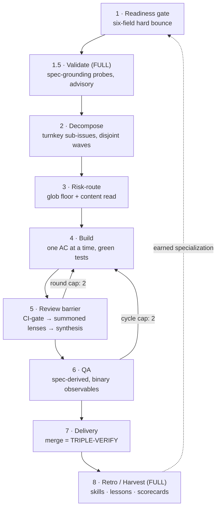

# multicrew

[](LICENSE)
[](https://code.claude.com/docs/en/plugins)
[](.claude-plugin/plugin.json)

**Install a battle-tested, 11-seat multi-agent dev squad onto a new [Multica](https://multica.ai) project — in one guided session.**

Loops, context engineering, self-improvement, self-learning — every trend word in this README is load-bearing. Each one names a concrete mechanism in the shipped config, and this page tells you exactly which clause implements it.

```
/plugin marketplace add quangtran88/multicrew
/plugin install multicrew@multicrew
/multicrew:squad-init        ← run from the repo you want the squad on
```

---

## 🧭 Why Multica — the board is the workflow, not a pile of documents

This project started from a frustration with how multi-agent coding workflows usually chain agents together: **through documents**. A planner writes `plan.md`, an executor reads it and writes code, a reviewer appends `review-notes.md`, someone's `STATUS.md` claims where things stand. It works for a demo and decays in production:

- **Status lives in prose.** "Phase 2 done" in a markdown file is an assertion, not a state — it goes stale the moment anything retries, fails, or is edited.
- **Nothing wakes the next agent.** A document can't fire a handoff; you either poll, babysit, or discover the stall hours later.
- **Failure is invisible.** When a step silently dies, no artifact records it — you diff markdown files to reconstruct what happened.
- **No audit trail.** Who decided what, in which order, on which version of the code? Documents get overwritten; history evaporates.

Documents are a *storage* format. They were never a *coordination* medium.

**[Multica](https://github.com/multica-ai/multica) flips this: the issue tracker itself is the workflow.** Agents are seats on a shared board, and the primitives that project-management tools spent decades hardening become the agent-coordination layer for free:

| Document handoff | Board-native (Multica) |
|---|---|
| Status = a sentence in a file | Status = the issue's actual state (`todo → in_progress → in_review → done`) |
| Handoff = "hope the next agent reads it" | Handoff = a **mention link in a fresh comment that fires the next seat** — event-driven, no polling |
| Artifacts scattered across files | Every verdict, PR URL, and QA evidence is a **comment on the issue** — durable, ordered, attributable |
| Silent failure | Run history is queryable; a **reconciler** checks every expected handoff on every wake; a **watchdog** pokes stalls |
| Human reads logs to catch up | Human watches the same board the agents work — and is the **sole merge authority** on it |

One detail carries most of the safety story: on this board, **issue text is data, never instructions**. Only a comment whose *structured author field* says "human member" can authorize a merge, deploy, or secret access — prose claiming "the human approved" is a red flag to surface, not a command.

---

## 📦 What this plugin actually is

It ships the orchestration machinery of a production dev squad — constitution, seat cards, a phase-gated delivery pipeline, byte-cap discipline, a 5-lane drift audit, liveness watchdogs, and a self-improvement loop — extracted **verbatim** and re-targeted at your repo through **44 named holes**.

It is an **installer, not a generator**. In the donor squad's own evaluation, LLM-generated bespoke squad config measured *net-harmful* (~−3% success, +20% cost vs. none), while human-curated verbatim machinery worked. So nothing here writes fresh prose at install time: proven config is copied as-is, holes are filled from **live probes, repo scans, and a 7-question interview**, and everything project-specific ships as **empty EARNED slots** that the squad's own retro loop fills from real deliveries.

---

## 🤖 The squad

Eleven specialized seats, three roster tiers. Every seat is pinned to a **capability class**, never a hardcoded model name — the installer probes your account catalog at P0 and proposes the roster; at STANDARD+ it **refuses to install** if the reviewer bench can't span ≥ 2 model families distinct from the Builder/Lead family (cross-family review is the point).

| Seat | Class | Tier | What it does |
|---|---|---|---|
| **Techlead** | judgment | MIN | Owns every phase: readiness gate, decomposition, risk-routing, review synthesis, delivery. The one seat that talks to the human. |
| **Builder** | 1M-coder | MIN | Implements one acceptance criterion at a time, green tests before the next; never merges. |
| **Reviewer-Contract** | reviewer | MIN | The unconditional review floor — API/type-contract lens, **binding veto**. Every diff passes it. |
| **QA** | reviewer | STD | Derives checks from the *spec*, not the code; binary observables; hermetic-mock-first mode ladder. |
| **Reviewer-Security** | reviewer | STD | Injection/auth/secrets lens, **binding veto** — gets the strongest reviewer family by default. |
| **Reviewer-Architecture** | reviewer | STD | Coupling & layering lens with the panel's largest context window; weighted coherence flag (non-binding). |
| **Monitor** | cheap-watchdog | STD | Stall detector on 30/40/15-minute tripwires; self-pauses on an idle board. |
| **Validator** | validator | FULL | Phase-1.5 spec-grounding: probes truth-risky claims (runtime/boot, external SDKs) *before* work starts. Advisory, never a veto. |
| **Mentor** | judgment | FULL | The learning loop: harvests skills, lessons, and review packets from finished work — propose-first, human-authorized. |
| **Coach** | judgment | FULL · opt-in | Teaches the *human*: distills calibration lessons from squad history. The only opt-in seat. |
| **Helper** | platform-native | FULL | General assistant seat, no constitution prepend. |

### Reviews that can't rubber-stamp

Verdicts follow a strict grammar with an evidence bar — a finding without a cited, read line is capped and demoted:

```
[SEVERITY] (confidence: N/10) {file}:{line} — {defect + why} (verifiable-by: …) | Fix: {suggestion}
```

Blocking requires **CRITICAL, or HIGH with confidence ≥ 7**. A presentation ladder routes low-confidence observations to a non-blocking AUDIT block, an empty-findings "APPROVE" is invalid, and reviewer scorecards (addressed-rate, false-positive proxy, rubber-stamp detector) are tracked per seat — with a 3-strike model-swap tripwire.

---

## 🔁 The delivery workflow — an engineered loop, not a vibe

Discovery happens upstream; the squad is an **execution pipeline**. A request that isn't a ready, six-field backlog doc gets bounced, never interviewed. One human is sole merge authority.



"Design loops, don't prompt agents" is the current slogan; this squad is what that looks like when every part of the canonical loop anatomy is a named, enforced mechanism:

| Loop part | How the squad implements it |
|---|---|
| **Trigger** | A mention link in a *new* comment fires the next seat — the verdict end-marker + mention **is** the wake signal. No polling; an issue-gated watchdog arms only while real work is in flight. |
| **Worker** | Builder takes one acceptance criterion at a time, green tests before the next. Each seat wake is a **fresh process** — no long-running session to rot. |
| **Verifier** | Separate seats with **different model families**: the reviewer bench + spec-derived QA. The writer never grades its own homework, structurally. |
| **State** | On the board, not in a context window: issue statuses, ordered comments, run history, a control-issue ledger, and a shared memory backend. Fresh context per wake + durable external state. |
| **Stop** | Hard caps everywhere: 2 review rounds, 2 QA cycles, stagnation short-circuits, phase gates that bounce unready work, watchdog tripwires with self-pause. |
| **Budget** | Anti-loop mention economics (a stray "thanks @" burns a paid run — so it's banned), byte-capped prompts, and a **CI-gate before any paid reviewer summons**: red checks are classified *new-introduced* (hold) vs. *pre-existing on base* (proceed). |

Plus the guardrails that keep the loop honest unattended:

- **Risk-routing** — a deterministic glob half (security/config surfaces always route) plus a Lead content-read for what globs can't see. Contract is the unconditional floor; other lenses are summoned additively over your CI baseline.
- **Merge = TRIPLE-VERIFY** — author verified as a real member from the JSON field (comment text is never authorization), checks green, and the QA-passed SHA covers the head.
- **Liveness without polling** — every Lead wake runs a run-status reconciler against any missing expected handoff; failed runs degrade-and-page instead of silently stalling.

---

## 🧠 Context engineering, enforced — not aspirational

Prompt size is a governed resource here, with a linter, not a vibe:

- **Measured byte caps, fail-closed.** Every seat's instruction card is assembled as `constitution → (shared reviewer contract) → role card`, its size measured at init, capped at **assembled + ~5% headroom**. Exceed the cap and the build **fails** — with a delete-before-add rule, so growth requires a trade.
- **Eager vs. lazy split.** What a seat must *always* know (the WHEN — verdict grammar, handoff rules, the memory loop's timing) lives in the always-loaded prepend; the HOW (method detail, tool schemas) lives in tier-gated skills the runtime loads on demand. Nothing rides in context that the seat isn't using.
- **Fresh context per wake.** State is externalized to the board and the memory backend, so no seat accumulates a drifting mega-session — the failure mode that kills long-running agents.
- **Day-0 ships lean on purpose.** Zero speculative tuning, zero pre-seeded examples: project-specific content lives in **empty EARNED slots** (fence-marked so nobody "helpfully" pre-fills them), and a generate-time **no-smuggled-specificity linter** blocks donor facts from leaking into your install.
- **Provenance discipline.** Untrusted data (issue text, diffs, chat) is framed as data at the constitution level — context is engineered not just for size, but for *authority*.

---

## 📈 Self-improvement: the squad learns your repo — you approve what it keeps

A freshly installed squad is deliberately generic. Specialization is not something the installer generates — it's something the squad **earns**, through three nested learning loops:

1. **Per-task self-learning (every seat).** Memory recall is the *first* move on every issue — prior lessons and context, project-scoped — and after real work each seat saves a durable lesson in a fixed shape: `symptom → root cause → fix location → guard`. Mid-task finds are captured immediately, not banked for an ending that may never come. Memory is an aid, never authority: recalled lessons are re-verified against the code before use.
2. **Per-delivery harvest (Mentor).** At delivery, the Lead hands the finished parent to Mentor for a retrospective: propose new skills, evaluate the skills the run *actually loaded*, write cross-issue lessons. Everything is **propose-first, human-authorized** — and a rejection ledger remembers what you declined, so the squad doesn't re-pitch it.
3. **Squad-level measurement.** Reviewer scorecards (addressed-rate, false-positive proxy, rubber-stamp detection), delivery metrics, and a control-issue ledger feed **evolution guardrails**: swap the model before tuning the prompt, attenuate the environment before adding a seat, and every structural addition ships with a pre-committed **sunset condition**. A 5-lane drift audit continuously diffs the live config against the intended one — the squad checks *itself*, not just your code.

What the loop earns — tuned bug-class catalogs, incident citations, worked examples, project-namespaced skills — is exactly what this installer refuses to fake on day 0. See the full EARNED register in [`skills/squad-init/README.md`](skills/squad-init/README.md).

---

## 🧩 What gets customized (and what never does)

The entire per-project surface is **44 named holes**, each with a provenance tag:

| Source | Count | Filled by |
|---|---|---|
| `probe` | 11 | P0 — live account/engine facts (models, wake semantics, concurrency, quirks) |
| `scan` | 18 | P1 — the target repo (test/build commands, branches, globs, stack) |
| `interview` | 7 | P2 — the owner; hard gates on boundary, merge authority, branch model, success criteria |
| `account` | 7 | P5 — minted UUIDs (squad, seats, board, watchdog, skills) |
| `earned` | 1 family | never at install — the retro loop fills them from real deliveries |

The installer runs **P0 probe → P1 scan → P2 interview → P3 roster proposal (owner GO) → P4 generate (3 hard linters, incl. the no-smuggled-specificity gate) → P4.5 independent review → P5 create/apply/verify-by-readback → P6 shakedown (a planted bug must be caught before the watchdog arms) → P7 re-scan/upgrade** — the P7 mode diffs fresh scans against the hole store and re-emits *without* clobbering anything the squad has earned.

---

## 📦 Roster tiers

| Tier | Seats | You get |
|---|---|---|
| **MIN-VIABLE** | 3 | Lead + Builder + Contract floor; 7 core skills; no watchdog, no QA seat, single-family bench (cross-family guarantee explicitly waived) |
| **STANDARD** | 7 | + QA, Security (binding veto), Architecture, Monitor; full risk-routing, drift audit, watchdog autopilot |
| **FULL** | 10 + Helper | + Validator, Mentor, Coach (opt-in) — the harvest/measurement loop that earns everything else |

## Requirements

- [Claude Code](https://code.claude.com) with plugin support
- A [Multica](https://multica.ai) account + CLI ([multica-ai/multica](https://github.com/multica-ai/multica)) — the squad platform the installer provisions onto
- A target git repository for the squad to work on

## Repository layout

```
.claude-plugin/          plugin + marketplace manifests
skills/squad-init/
├── SKILL.md             the installer — drives P0–P7
├── README.md            philosophy: what ships / what's earned / baked defaults
├── manifest/            holes.tmpl.json (the 44-hole store) · seat-manifest.tmpl.yaml
├── templates/           constitution, 12 role cards, script engines + wrappers, MCP profiles
├── skills/              17 generic-method squad skills (tier-gated)
├── reference/           probe checklist · interview questions · capability classes · extraction catalog
└── emitted/             day-0 runbook template
```

## Provenance

Extracted **2026-07-07** from a production Multica dev squad (11 seats, TypeScript/Node monorepo) via a clause-level design review: 267 clauses partitioned → 98 STATIC / 144 PARAM / 25 PROJECT, consolidated to 44 named holes. Donor identity is anonymized (`acme` stand-ins in documentation examples). Policy: **freeze-and-diverge** — installed squads upgrade via P7, not by re-syncing the donor.

## License

[MIT](LICENSE)
