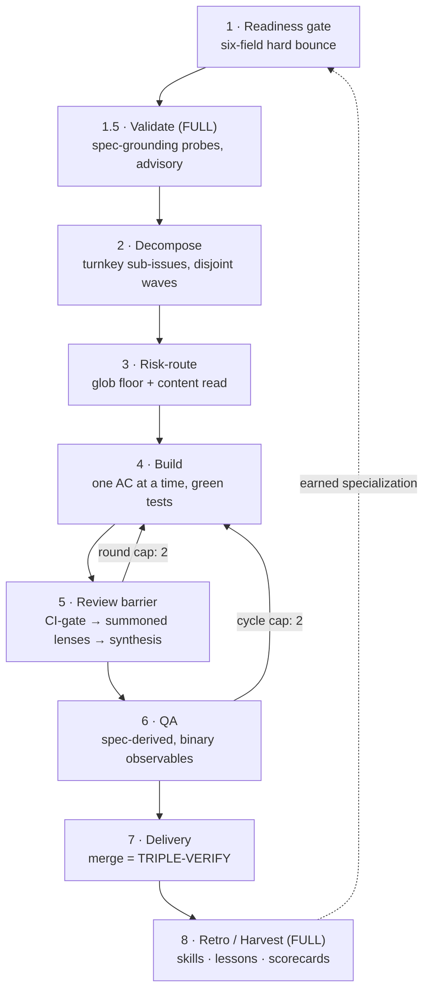

# multicrew

[](LICENSE)
[](https://code.claude.com/docs/en/plugins)
[](.claude-plugin/plugin.json)

**Install a battle-tested, 11-seat multi-agent dev squad onto a new Multica project — in one guided session.**

This plugin ships the orchestration machinery of a production dev squad — constitution, seat cards, a phase-gated delivery pipeline, byte-cap discipline, a 5-lane drift audit, liveness watchdogs, and a self-improvement loop — extracted **verbatim** and re-targeted at your repo through **44 named holes**.

It is an **installer, not a generator**. In the donor squad's own evaluation, LLM-generated bespoke squad config measured *net-harmful* (~−3% success, +20% cost vs. none), while human-curated verbatim machinery worked. So nothing here writes fresh prose at install time: proven config is copied as-is, holes are filled from **live probes, repo scans, and a 7-question interview**, and everything project-specific ships as **empty EARNED slots** that the squad's own retro loop fills from real deliveries.

```
/plugin marketplace add quangtran88/multicrew
/plugin install multicrew@multicrew
/multicrew:squad-init        ← run from the repo you want the squad on
```

---

## 🤖 The squad

Eleven specialized seats, three roster tiers. Every seat is pinned to a **capability class**, never a hardcoded model name — the installer probes your account catalog at P0 and proposes the roster; at STANDARD+ it **refuses to install** if the reviewer bench can't span ≥ 2 model families distinct from the Builder/Lead family (cross-family review is the point).

| Seat | Class | Tier | What it does |
|---|---|---|---|
| **Techlead** | judgment | MIN | Owns every phase: readiness gate, decomposition, risk-routing, review synthesis, delivery. The one seat that talks to the human. |
| **Builder** | 1M-coder | MIN | Implements one acceptance criterion at a time, green tests before the next; never merges. |
| **Reviewer-Contract** | reviewer | MIN | The unconditional review floor — API/type-contract lens, **binding veto**. Every diff passes it. |
| **QA** | reviewer | STD | Derives checks from the *spec*, not the code; binary observables; hermetic-mock-first mode ladder. |
| **Reviewer-Security** | reviewer | STD | Injection/auth/secrets lens, **binding veto** — gets the strongest reviewer family by default. |
| **Reviewer-Architecture** | reviewer | STD | Coupling & layering lens with the panel's largest context window; weighted coherence flag (non-binding). |
| **Monitor** | cheap-watchdog | STD | Stall detector on 30/40/15-minute tripwires; self-pauses on an idle board. |
| **Validator** | validator | FULL | Phase-1.5 spec-grounding: probes truth-risky claims (runtime/boot, external SDKs) *before* work starts. Advisory, never a veto. |
| **Mentor** | judgment | FULL | The learning loop: harvests skills, lessons, and review packets from finished work — propose-first, human-authorized. |
| **Coach** | judgment | FULL · opt-in | Teaches the *human*: distills calibration lessons from squad history. The only opt-in seat. |
| **Helper** | platform-native | FULL | General assistant seat, no constitution prepend. |

Every seat's instruction card is assembled as `constitution → (shared reviewer contract) → role card`, with **measured byte caps** (assembled size + 5% headroom, fail-closed) and a delete-before-add rule — prompt bloat is a governed resource, not a vibe.

### Reviews that can't rubber-stamp

Verdicts follow a strict grammar with an evidence bar — a finding without a cited, read line is capped and demoted:

```
[SEVERITY] (confidence: N/10) {file}:{line} — {defect + why} (verifiable-by: …) | Fix: {suggestion}
```

Blocking requires **CRITICAL, or HIGH with confidence ≥ 7**. A presentation ladder routes low-confidence observations to a non-blocking AUDIT block, an empty-findings "APPROVE" is invalid, and reviewer scorecards (addressed-rate, false-positive proxy, rubber-stamp detector) are tracked per seat — with a 3-strike model-swap tripwire.

---

## 🔁 The delivery workflow

Discovery happens upstream; the squad is an **execution pipeline**. A request that isn't a ready, six-field backlog doc gets bounced, never interviewed. One human is sole merge authority.



The parts that make it hold up unattended:

- **Risk-routing** — a deterministic glob half (security/config surfaces always route) plus a Lead content-read for what globs can't see. Contract is the unconditional floor; other lenses are summoned additively over your CI baseline.
- **CI-gate before any paid summons** — red checks are classified *new-introduced* (hold) vs. *pre-existing on base* (proceed), so the squad never burns reviewer tokens on a broken base.
- **Merge = TRIPLE-VERIFY** — author verified as a real member from the JSON field (comment text is never authorization), checks green, and the QA-passed SHA covers the head. Issue text is treated as untrusted data end to end.
- **Liveness without polling** — every Lead wake runs a run-status reconciler; the end-marker + mention *is* the wake signal; an issue-gated watchdog autopilot arms only while real work is in flight and stands down on an idle board.
- **Evolution guardrails** — swap the model before tuning the prompt; attenuate the environment before adding a seat; asymmetric add/cut damping; every structural addition ships with a pre-committed sunset condition.
- **Anti-loop economics** — mention rules and caps everywhere: 2 review rounds, 2 QA cycles, stagnation short-circuits.

---

## 🧩 What gets customized (and what never does)

The entire per-project surface is **44 named holes**, each with a provenance tag:

| Source | Count | Filled by |
|---|---|---|
| `probe` | 11 | P0 — live account/engine facts (models, wake semantics, concurrency, quirks) |
| `scan` | 18 | P1 — the target repo (test/build commands, branches, globs, stack) |
| `interview` | 7 | P2 — the owner; hard gates on boundary, merge authority, branch model, success criteria |
| `account` | 7 | P5 — minted UUIDs (squad, seats, board, watchdog, skills) |
| `earned` | 1 family | never at install — the retro loop fills them from real deliveries |

The installer runs **P0 probe → P1 scan → P2 interview → P3 roster proposal (owner GO) → P4 generate (3 hard linters, incl. a no-smuggled-specificity gate) → P4.5 independent review → P5 create/apply/verify-by-readback → P6 shakedown (a planted bug must be caught before the watchdog arms) → P7 re-scan/upgrade** — the P7 mode diffs fresh scans against the hole store and re-emits *without* clobbering anything the squad has earned.

Deliberately **not** shipped: tuned bug-class catalogs, incident citations, worked examples, project-namespaced skills, migration history. Day-0 is generic on purpose; the loop that earns specialization ships instead — see [`skills/squad-init/README.md`](skills/squad-init/README.md) for the full EARNED register.

---

## 📦 Roster tiers

| Tier | Seats | You get |
|---|---|---|
| **MIN-VIABLE** | 3 | Lead + Builder + Contract floor; 7 core skills; no watchdog, no QA seat, single-family bench (cross-family guarantee explicitly waived) |
| **STANDARD** | 7 | + QA, Security (binding veto), Architecture, Monitor; full risk-routing, drift audit, watchdog autopilot |
| **FULL** | 10 + Helper | + Validator, Mentor, Coach (opt-in) — the harvest/measurement loop that earns everything else |

## Requirements

- [Claude Code](https://code.claude.com) with plugin support
- A Multica account + CLI (the squad platform the installer provisions onto)
- A target git repository for the squad to work on

## Repository layout

```
.claude-plugin/          plugin + marketplace manifests
skills/squad-init/
├── SKILL.md             the installer — drives P0–P7
├── README.md            philosophy: what ships / what's earned / baked defaults
├── manifest/            holes.tmpl.json (the 44-hole store) · seat-manifest.tmpl.yaml
├── templates/           constitution, 12 role cards, script engines + wrappers, MCP profiles
├── skills/              17 generic-method squad skills (tier-gated)
├── reference/           probe checklist · interview questions · capability classes · extraction catalog
└── emitted/             day-0 runbook template
```

## Provenance

Extracted **2026-07-07** from a production Multica dev squad (11 seats, TypeScript/Node monorepo) via a clause-level design review: 267 clauses partitioned → 98 STATIC / 144 PARAM / 25 PROJECT, consolidated to 44 named holes. Donor identity is anonymized (`acme` stand-ins in documentation examples). Policy: **freeze-and-diverge** — installed squads upgrade via P7, not by re-syncing the donor.

## License

[MIT](LICENSE)
